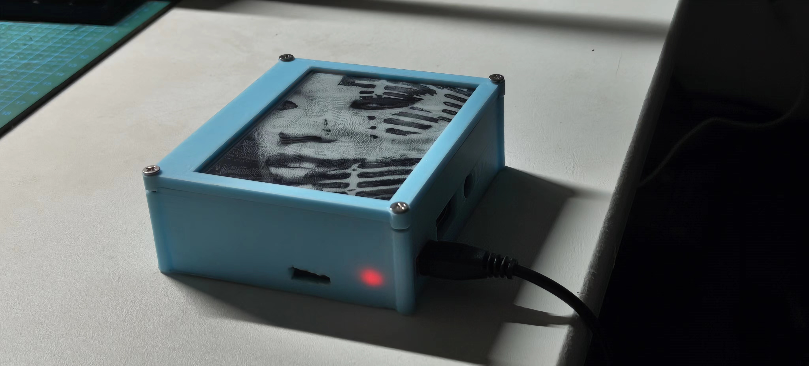

# E-Ink Display
E-Ink Display for Raspberry Pi based on Waveshare e-Paper library and 4.2 inch e-Paper display.


### Features
- Play images from the local memory
- Update images from the USB drive
- update configuration from the USB drive
- Connect to WiFi by updating the wifi.txt file in the USB drive
- Load the image from internet based on the configuration file
- Server to upload the images and update configuration. can be acessed on http://ip_address:8080

## Installation
1. Install raspbian on a Raspberry Pi
2. Update the system
```bash
sudo apt-get update
sudo apt-get upgrade
```
3. Install the required packages
```bash
sudo apt install git python3-pip python3-pil python3-numpy python3-spidev -y
```
4. Enable SPI
```bash
sudo raspi-config
```
Interfacing Options -> SPI -> Yes -> Finish -> Reboot
5. You can get the e-ink display library from the following link
```bash
git clone https://github.com/waveshare/e-Paper.git
```
With examples in 'e-Paper/RaspberryPi_JetsonNano/python/examples/'
Or you can clone this repository (include only python package for raspberry pi)
```bash
git clone https://github.com/Ajasra/EinkFrame.git
```
6. Install additional packages
```bash
pip install RPi.GPIO requests Pillow numpy
```

## Assembly
1. Connect the waveshare e-ink display to the Raspberry Pi
2. Connect the button to the GND and PIN 32 (You can use another pin, but you need to change the code)
3. Print the frame and attach the e-ink display to it


## Configuration
1. Update <b>settings.py</b> with the following information (You can use the example file)
2. You can use USB drive to update the images, just copy the images to the USB drive folder and plug it to the Raspberry Pi
3. You can update the config file by copying the config file to the USB drive and plug it to the Raspberry Pi
```json
{
	"mode": 2,
	"refresh_rate": 60,
	"random": 1,
	"url_config": "http://eink.vasily.onl/config/config.txt",
	"url_image": "http://eink.vasily.onl/images/current/img.jpg"
}
```
5. You can connect to WiFi by updating the wifi.txt file in the USB drive and plug it to the Raspberry Pi
'wifi.txt' file should contain the following information
```json
network={
    ssid="YOUR_SSID"
    ps="YOUR_PASSWORD"
}
```

## Auto Start on Boot
There are two service can be running on the start:
- eink service
- eink_update server

1. Create a new systemd service file:
```bash
sudo nano /lib/systemd/system/eink.service
```
2. Enable the service to start on boot:
```bash
sudo systemctl enable my_script.service
```
3. Start the service:
```bash
sudo systemctl start my_script.service
```
4. To stop the service for changes:
```bash
sudo systemctl stop eink.service
```
5. Reload the systemd manager configuration after making changes and before starting the service:
```bash
sudo systemctl daemon-reload
```
6. Start the service after making changes:
```bash
sudo systemctl start eink.service
```

Additional useful commands for testing and debugging:
```bash
# Reload the systemd manager configuration:
sudo systemctl daemon-reload
# Start the service manually:
sudo systemctl start eink.service
# Check the status of the service:
sudo systemctl status eink.service
# Check the logs for any errors:
sudo journalctl -u eink.service
# Reboot the Raspberry Pi to ensure the service starts on boot:
sudo reboot
```